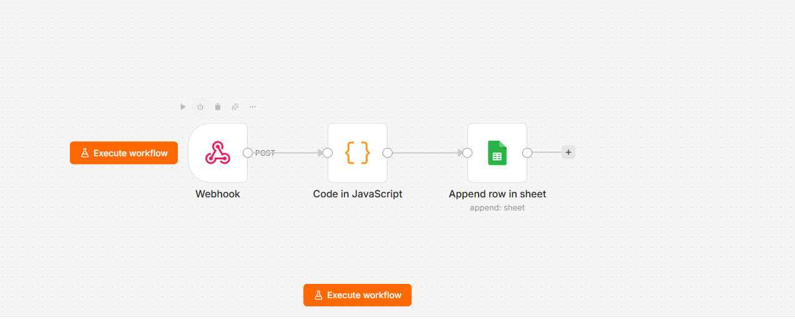

# Automatización de registro de facturas (n8n)

Mini pipeline que simula la recepción de una factura y la registra automáticamente en una planilla, sin intervención manual.

## Qué hace

1. **Webhook** recibe los datos de una factura (empresa, monto, fecha de vencimiento).
2. **Code (JavaScript)** valida que los campos requeridos estén presentes.
3. **Google Sheets** agrega una fila nueva con el registro.

## Arquitectura





## Cómo probarlo

```bash
curl -X POST https://gabrielasromero18.app.n8n.cloud/webhook/factura \
  -H "Content-Type: application/json" \
  -d '{"empresa":"EDESUR","monto":15000,"fecha_vencimiento":"2026-09-25"}'
```

## Nota

Este demo usa un webhook para simular la llegada de una factura. En un caso real, el disparador sería un listener de Gmail/Outlook, con extracción de datos del PDF adjunto vía OCR o un modelo de IA.

## Próximos pasos

- Reemplazar el webhook por un trigger real de email.
- Parsear el PDF adjunto para extraer los datos automáticamente.
- Agregar notificación por Telegram al registrar cada factura.

## Stack

n8n · Google Sheets API · JavaScript
